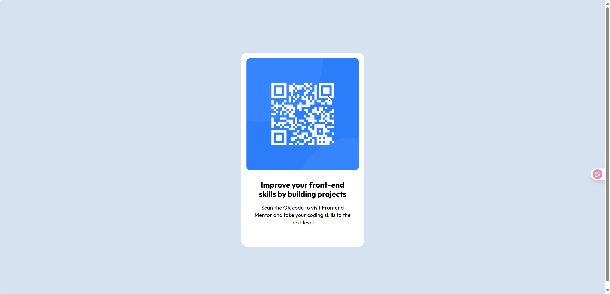

# Frontend Mentor - QR code component solution

This is a solution to the [QR code component challenge on Frontend Mentor](https://www.frontendmentor.io/challenges/qr-code-component-iux_sIO_H). Frontend Mentor challenges help you improve your coding skills by building realistic projects. 

## Table of contents

- [Overview](#overview)
  - [Screenshot](#screenshot)
- [My process](#my-process)
  - [Built with](#built-with)
  - [What I learned](#what-i-learned)
  - [Continued development](#continued-development)
  - [Useful resources](#useful-resources)
- [Author](#author)
- [Acknowledgments](#acknowledgments)

## Overview

### Screenshot



## My process

### Built with

- Semantic HTML5 markup
- CSS custom properties (variables)
- Flexbox (for centering and layout)
- Mobile-first workflow
- Vanilla CSS (no preprocessors or frameworks)

### What I learned
I'm a beginner in frontend development. Although I have some Python development experience, it didn't help much with this current project. At the beginning, I felt completely lost and almost wanted to give up. However, the first challenge in learning is right here - giving up is easy, but perseverance is more valuable. You could simply copy others' code, but that way you'll never truly learn. When encountering difficulties during learning, you can ask AI for help or refer to others' work, but always make sure to carefully think through the underlying principles.


```html
  <main class="qr-code">
    <div class="qr-code-image">
      
    </div>
    <div class="qr-code-text">
      <h1 class="qr-code-text-title">Improve your front-end skills by building projects</h1>
      <p class="qr-code-text-description">Scan the QR code to visit Frontend Mentor and take your coding skills to the next level</p>
    </div>
  </main>
```
In this code, I learned about custom tags. This is the first time I've implemented an HTML snippet completely on my own without referring to others' work. Although it's very short, it still serves as a good starting point.

```css
:root {
    /* 颜色变量 */
    --clr-slate-900: hsl(218, 44%, 22%);
    --clr-slate-500: hsl(216, 15%, 48%);
    --clr-slate-300: hsl(212, 45%, 89%);
    --clr-white: hsl(0, 0%, 100%);

    /* 字体变量 */
    --ff-outfit: 'Outfit', sans-serif;

    /* Text Preset 1 - Bold */
    --tp1-size: 22px;
    --tp1-line-height: 1.2;
    --tp1-spacing: 0px;
    --tp1-weight: bold;

    /* Text Preset 2 - Regular */
    --tp2-size: 15px;
    --tp2-line-height: 1.4;
    --tp2-spacing: 0.2px;
    --tp2-weight: regular;

    --space-500: 40px;
    --space-300: 24px;
    --space-200: 16px;
}
```
I learned about CSS variables (custom properties) from studying [@vinibleik](https://github.com/vinibleik)'s implementation. Initially I was using plain CSS but encountered difficulties, so I started exploring community solutions to learn from them - not just copying blindly. Whenever I didn't understand something, I asked AI assistants until I fully grasped the concepts. Sometimes creating my own visual examples was the best way to learn.

The CSS variables approach helped me:
1. Better organize and maintain my styles
2. Create consistent design tokens for colors, spacing and typography
3. Make global changes more efficiently
4. Improve readability of my CSS code

This was my first time using CSS variables in a real project, and I can see how powerful they are for building maintainable stylesheets.


### Continued development

I need to become more familiar with APIs and development workflows. For my first development experience, I need to strengthen my understanding of design specifications and insights into various design approaches. In the future, I should gradually implement these features using more modern methods, and continuously review and learn from them.


### Useful resources

- [A good solution](https://github.com/vinibleik/qr-code-component) - This helps me sort out my thoughts
- [Cursor](https://www.cursor.com/) - A good tool for coding

## Author

- Github - [@Nydaym](https://github.com/Nydaym)

## Acknowledgments

Thanks to the community for their help and for sharing their public solutions


